# [ Nariman.J ]


```
AI Engineer | Data Scientist | Full-Stack Developer
```

## `[ Core Skills ]`

```python
skills = {
    'AI & ML': ['Deep Learning', 'NLP', 'Statistical Modeling'],
    'Data Science': ['Predictive Analytics', 'Data Mining', 'Feature Engineering'],
    'Mathematics': ['Linear Algebra', 'Calculus', 'Probability & Statistics'],
    'Software Dev': ['API Design', 'System Architecture', 'Cloud Infrastructure']
}
```
## `[ Tech Stack ]`

<div align="center">
  
  <!-- Languages -->
  
  
  
  
  
  
  
  
  
  <!-- Frontend / Mobile -->
  
  
  

  <!-- AI/ML -->
  
  
  
  

  <!-- Backend / Frameworks -->
  
  
  

  <!-- LLM / Vector DB -->
  
  
  
  <!-- Tools -->
  
  
  
  
</div>


## `[ Contribution Stats ]`

<!-- GitHub Streak Stats -->
<p align="center">
  
</p>

<!-- Profile Summary Card (may be flaky depending on upstream) -->


<!-- GitHub Stats Card (Shows PRs, Issues, and Grade) -->
<!-- My Secure GitHub Stats Card -->
<p align="center">
  
</p>


<!-- Snake Contribution Animation (generated via GitHub Actions) -->
<!-- Snake Contribution Animation -->
<!-- <p align="center">
  <picture>
    <source media="(prefers-color-scheme: dark)" srcset="https://raw.githubusercontent.com/snowholt/snowholt/output/github-contribution-grid-snake-dark.svg">
    <source media="(prefers-color-scheme: light)" srcset="https://raw.githubusercontent.com/snowholt/snowholt/output/github-contribution-grid-snake.svg">
    
  </picture>
</p> -->

## `[ Current Focus ]`
```shell
$ current_projects --list
> Edge AI Deployment and AI Integration
> Probabilistic Graphical Models
> Mobile Applications
```

<div align="center">
  
```
[ Connect ]
```
  
[](https://www.linkedin.com/in/narimanjafari/)
[](mailto:jafari.nariman@gmail.com)
[](https://snowholt.github.io/)
  
</div>
